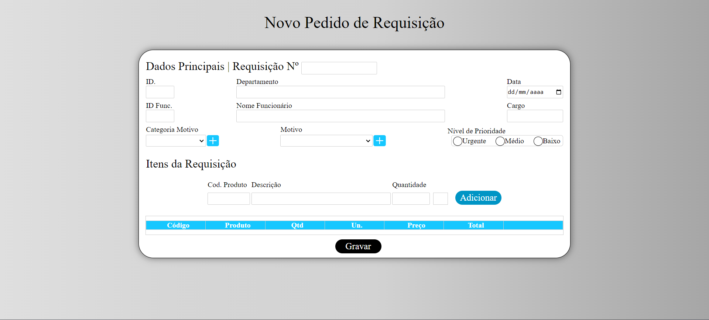
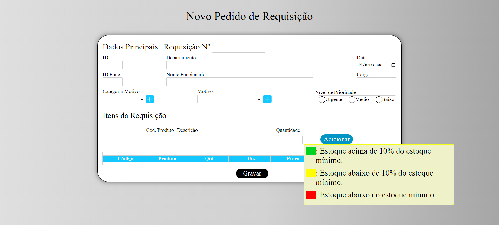

<h1 align="center">Almoxarifado</h1>

Projeto desenvolvido no treinamento programador fullstack (Realizado pelo SENAI), do programa Meu Primeiro Emprego.  
<a href="https://primeiroemprego.se.gov.br/" target="_blank">Mais informações sobre o programa Meu Primeiro Emprego.</a>

 

  
  
Formulário de requisição

   

  
  
Formulário com Tooltip

  <a href="https://777diegoribeiro777.github.io/relogioDigital/" style="font-weight: bold;" target="_blank">💎 Link para o projeto.</a>

## 🚀 Tecnologias

Esse projeto foi desenvolvido com as seguintes tecnologias:

- HTML
- CSS
- JavaScript
- Git e Github

## 💻 Projeto

O projeto tem como propósito desenvolver uma tela de pedido de requisição de um almoxarifado. Os requisitos necessários foram fornecidos durante uma apresentação do professor, destacando o enfoque no aprimoramento dos conhecimentos em Javascript. Nesse contexto, um modelo básico de formulário foi inicialmente disponibilizado para servir como ponto de partida, permitindo assim uma abordagem mais aprofundada e prática na linguagem de programação. O principal objetivo é não apenas aplicar os conceitos já adquiridos, mas também expandir a compreensão e habilidades por meio da implementação prática desses requisitos específicos.
